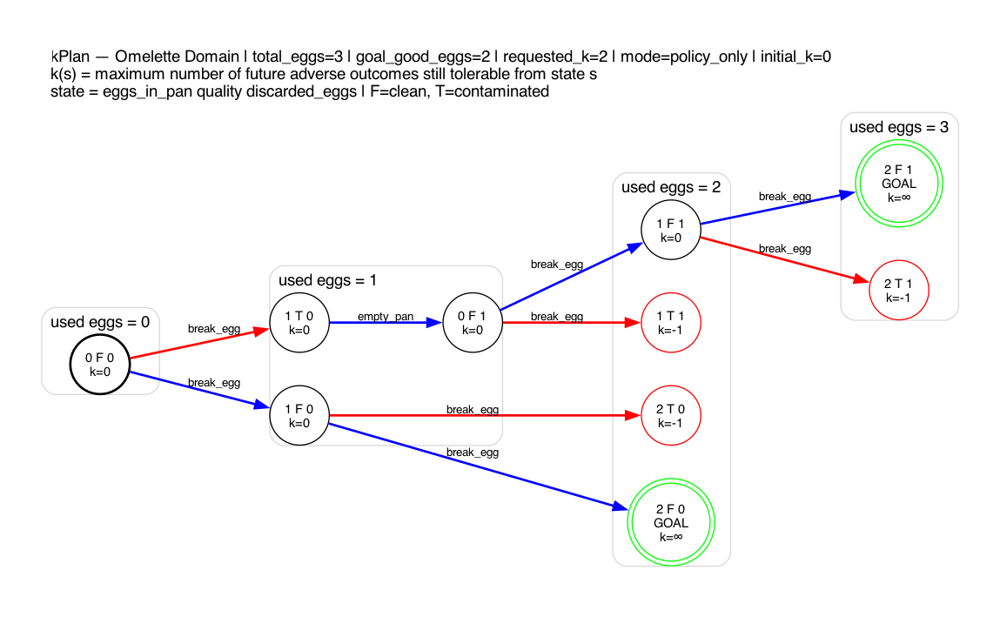
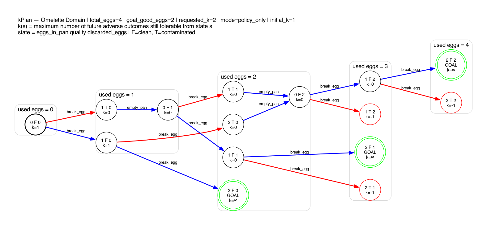

# kplan

Robust Planning in Non-Deterministic Domains

kplan is an experimental open-source project that implements a robust planning engine for non-deterministic environments with a bounded number of adverse outcomes.

The core idea is the concept of a **k-plan**:

> A policy that guarantees reaching the goal despite up to **k** adverse events.

## Motivation

Many real-world systems operate in environments where actions may have multiple possible outcomes:

- autonomous robots (slippage, sensor errors)
- distributed systems (timeouts, failures)
- logistics (delays, unexpected events)

Traditional approaches typically assume:

- deterministic environments
- probabilistic models

This project explores a different perspective:

**Adversarial non-determinism with bounded failure tolerance**

Instead of modeling probabilities, we assume that the environment may behave adversarially, but only up to a fixed number of failures.

## Quick intuition



## What is a k-plan?

Given:

- a non-deterministic domain
- a goal condition
- a maximum number of tolerated adverse outcomes `k`

A **k-plan** is a policy that guarantees reaching the goal if the number of adverse events does not exceed `k`.

### Interpretation

- `k = 0`  
  A plan exists, but it guarantees success only in the absence of adverse outcomes.

- `k > 0`  
  The plan is robust and can tolerate up to `k` deviations.

## Key concept

Each state is assigned a value:

> `k(s) = maximum number of future adverse outcomes still tolerable from state s`

Important:

- `k(s)` depends only on the current state, not on the path used to reach it
- it represents future robustness, not past failures
- even after multiple adverse events, a state may still have `k = 0` if a successful path exists

## Approach

The system is based on:

- state-space exploration
- explicit successor/predecessor graph construction
- backward propagation from goal states
- assignment of `k` values to each state
- extraction of a policy (`state → action`)

Key characteristics:

- no probabilities in the core model
- adversarial interpretation of non-determinism
- explicit handling of failure tolerance

## Example domains

### Rover (Gridworld)

A simple domain where:

- the rover moves in a grid
- actions may result in:
  - intended movement
  - lateral deviation
  - no movement (failure)

Goal:
- reach a target cell despite uncertainty

### Omelette domain

A didactic domain used to illustrate robustness.

Actions:

- `BREAK_EGG` → may add a good egg or a bad egg (adverse outcome)
- `EMPTY_PAN` → clears the pan (necessary after contamination)

Goal:
- reach a state with a required number of good eggs in the pan

Key aspects:

- non-determinism models real-world uncertainty (bad eggs)
- some states are dead-ends (`k = -1`)
- robustness depends on remaining usable eggs

This domain clearly shows the meaning of `k`:

- higher `k` → more tolerance to bad outcomes
- `k = 0` → only the “lucky path” remains
- `k = -1` → goal is unreachable

### Example visualization

The graph below shows the policy extracted for the omelette domain.

- blue edges → policy actions
- red edges → adverse outcomes



## Visualization

The visualization system is designed to be domain-agnostic.

Domain-specific rendering is handled through `VisualizationProfile`:

- `GraphvizExporter` → generic rendering engine
- `VisualizationProfile` → domain-specific behavior

This allows:

- custom layouts per domain
- custom state representations
- custom clustering and semantics

without modifying the exporter.

Features:

- full state graph rendering (`full_graph`)
- policy-only rendering (`policy_only`)
- automatic layout for specific domains (e.g. omelette)

Color semantics:

- blue → policy action
- red → adverse outcome
- green → goal state

Node borders:

- double circle → goal state
- red border → dead-end (`k = -1`)

Example:

```bash
python -m scripts.omelette_graphviz --png
```

Outputs:

- `.dot` files (Graphviz source)
- `.png` images (rendered graphs)

## Project structure

```text
kplan/
├── core/
│   ├── state.py
│   ├── action.py
│   ├── problem.py
│   ├── planner.py
│   ├── policy.py
│   └── planning_result.py
│
├── algorithms/
│   └── kplan_solver.py
│
├── domains/
│   ├── rover/
│   └── omelette/
│
├── kplan_io/
│   └── pddl/
│       ├── ast.py
│       ├── parser.py
│       └── errors.py
│
├── visualization/
│   ├── graphviz_exporter.py
│   ├── profile.py
│   └── profiles/
│       └── omelette_profile.py
│
├── scripts/
│   ├── omelette_graphviz.py
│   └── rover_graphviz.py
│
├── outputs/
│   ├── dot/
│   └── images/
│
├── tests/
│
└── docs/
```

## PDDL support (experimental)

The project includes an experimental PDDL-FOND parsing layer.

This module allows loading domains and problems written in PDDL,
using a strict internal representation aligned with kplan’s semantics.

Key characteristics:

- strict separation between external parser and internal AST
- deterministic normalization of effects (all actions become `oneof`)
- explicit rejection of unsupported PDDL features
- no external types leak into the core system

Current scope:

- parsing and validation of a restricted PDDL subset
- support for:
  - typing
  - negative preconditions
  - non-deterministic effects (`oneof`)
- normalization of effects into a unified internal structure

Not implemented yet:

- grounding (ActionSchema → GroundAction)
- direct execution via CLI
- integration with solver (planned next steps)

See:

- `docs/pddl-integration.md` for full technical details

## Running the project

### Install dependencies

```bash
python -m venv .venv
source .venv/bin/activate
pip install -e .
```

Run tests

```bash
pytest
```

Static analysis

```bash
mypy .
ruff check .
```

```text
Current status
	•	✅ Generic domain modeling
	•	✅ k-plan solver
	•	✅ Backward propagation of k-values
	•	✅ Policy extraction
	•	✅ Rover domain
	•	✅ Omelette domain
	•	✅ Graph visualization (Graphviz)
	•	✅ Policy-only graph extraction
	•	✅ Full test suite
```

Roadmap

```text
Planned extensions:
	•	richer domains
	•	heuristic guidance
	•	interactive visualization
	•	probabilistic evaluation layer
	•	performance optimizations
```

Background

This project is based on academic work on:

automatic synthesis of robust plans in non-deterministic domains

and revisits the concept of bounded-failure planning with a modern software architecture.

The original idea of the k-plan algorithm was developed in an academic context under the guidance of Professor Benedetto Intrigila (2012).

This implementation extends that idea into a reusable and extensible software system.

Contributing

This is an early-stage, research-oriented project.

Feedback, discussions and contributions are welcome.

Author

Paolo Servilio

License

MIT